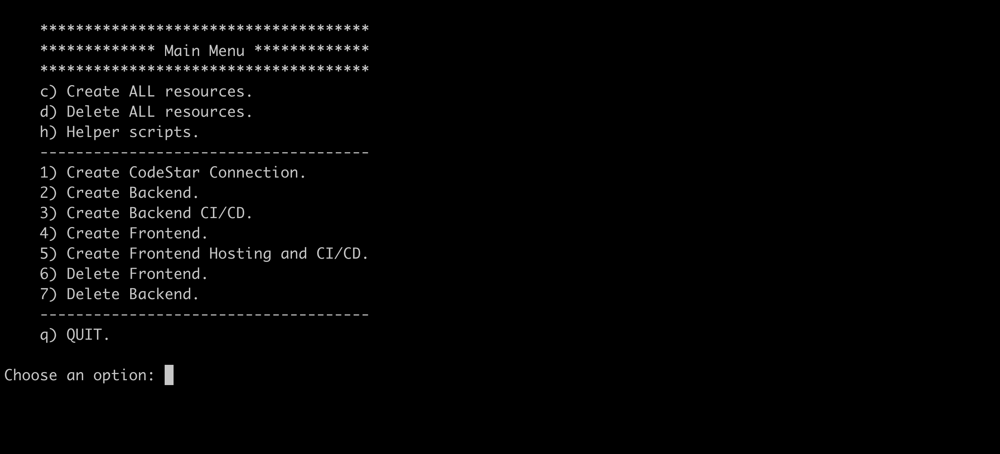

## Hiperium City Tasks Service: Tasks Microservice that run Cron Jobs on AWS Fargate.

* **Author**: [Andres Solorzano](https://www.linkedin.com/in/aosolorzano/).
* **Level**: Advanced.
* **Technologies**: Java, GraalVM, Quarkus, Quartz, Ionic, Angular, NgRx, Docker, Amazon Cognito, AuroraDB (PostgreSQL), Amplify, Amazon ELB, Fargate ECS and CloudFormation.

---

## Description
This project uses the Quarkus Framework to perform CRUD operations over Tasks records that store Quartz Jobs on AWS Aurora Postgres DB. 
This timers must be executed automatically by the Quartz Framework. The project also uses the AWS Amplify Framework and is deployed on AWS Fargate ECS using AWS Copilot.

The following image shows the overall architecture of the application on AWS.


If you want to learn more about Quarkus, please visit its website: https://quarkus.io/.

---

## Project's details on Medium.com
You can follow the last project's details on my [Medium blog](https://aosolorzano.medium.com). If you want to see the last details, you can read the following articles:
* CI/CD pipeline configuration [post](https://aosolorzano.medium.com/configuring-a-ci-cd-pipeline-using-the-amazon-copilot-cli-54f3886fbfaf).
* OpenID Connect and OAuth 2.0 [post](https://aosolorzano.medium.com/implementing-sso-with-amazon-cognito-as-an-identity-provider-idp-38d8e1d4c98d).
* Implementing Multi-Account Environment on AWS [post](https://aosolorzano.medium.com/implementing-a-multi-account-environment-with-aws-organizations-and-the-iam-identity-center-d1cdb40bdf4d).
* Implementing an Application Load Balancer on AWS [post](https://aosolorzano.medium.com/configuring-an-application-load-balancer-for-an-ecs-cluster-using-the-aws-copilot-cli-865e1b2c34d2).
---

## Requirements
1. An AWS account.
2. [Git](https://git-scm.com/downloads).
3. [AWS CLI](https://docs.aws.amazon.com/cli/latest/userguide/getting-started-install.html) version 2.
4. [Amplify CLI](https://docs.amplify.aws/cli/start/install).
5. [AWS Copilot CLI](https://aws.github.io/copilot-cli/) version 1.23.0.
6. OpenJDK 11. You can use [SDKMAN](https://sdkman.io/install).
7. [Maven](https://maven.apache.org/download.cgi).
8. [Docker](https://www.docker.com/products/docker-desktop/)
9. [Docker Compose](https://github.com/docker/compose).


## Installing supported AWS Copilot CLI version
Execute the following command to install the supported version of AWS Copilot CLI for ARM64 architecture:
```bash
curl -Lo copilot https://github.com/aws/copilot-cli/releases/download/v1.23.0/copilot-darwin-arm64   && \
chmod +x copilot                                     && \
sudo mv copilot /usr/local/bin/copilot               && \
copilot --version
```
If everything is OK, you must see the version v1.23.0 in your terminal window.

---

## Deploying Tasks Service App on AWS
Execute the following script and follow the steps:
```bash
run-scripts.sh
```


After running the required steps, you don't need to follow the next sections in this page.

---

## Deploying Tasks Service locally
We need to deploy only the Amplify project to AWS. The backend project can be deployed locally.

### Deploy Tasks Service's Amplify project
Go to the Ionic/Angular project folder `src/hiperium-city-tasks-pwa` and configure Amplify application:
```bash
amplify init
```

### Deploy Tasks Service API
First, update the `.env` file located at `utils/docker/compose` directory in the API project with the corresponding value for the `QUARKUS_OIDC_AUTH_SERVER_URL` variable.
Then, return to the project's root directory and execute the following command to build the Tasks Service API:
```bash
docker compose up --build
```

## Publishing Tasks Service App
In another terminal, execute the following commands in the `src/hiperium-city-tasks-pwa` directory to deploy the Ionic app locally:
```bash
npm install
ionic build
ionic serve
```
